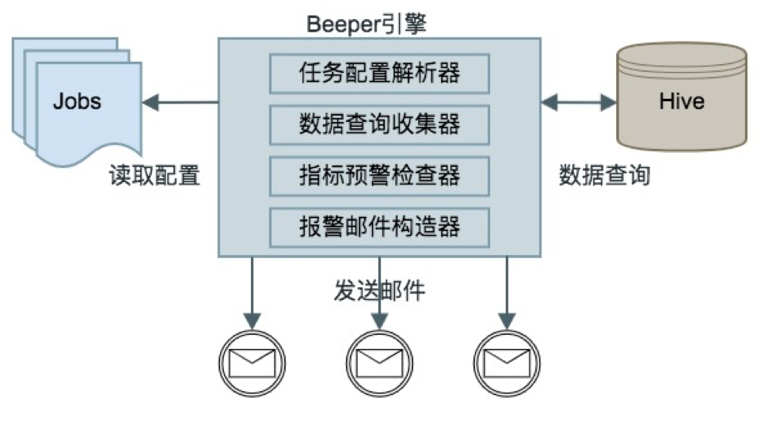
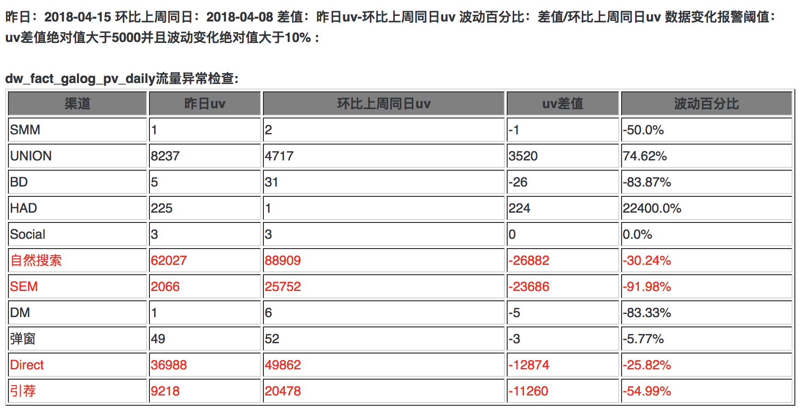

## 数据部数据质量预警与自动化数据测试工具

### 一、Beeper产生原因
Beeper就是当年的BP机，能发出哔哔的声音，也有通知、报警器的意思，这里用来作为数据质量预警工具的别名。作为数据开发，多数情况下需要每天自动检查数据质量是否有问题，有以下几方面需要关注：
- 每天是否有数据，在检查时间点是否按时产出了数据
- 数据是否完整，例如流量的各个渠道是否都有数据
- 是否有脏数据，数据加工错误导致产出了脏数据
- 数据波动是否正常，某些维度上的指标相对前段时间是否在合理范围内
针对上面几种情况，Beeper能满足预警功能。

### 二、Beeper工作原理
Beeper是用python2.7开发，因为要监控大数据平台上的hive数据，需要用azkaban进行任务调度。
Beeper是基于即时查询hive实现，这就要工程师预先写好hql并配置好预警规则。
目前beeper支持mysql, hive, presto查询




1.	Beeper读取jobconfs目录下文件，一个配置文件代表一个预警任务
2.	配置解析器对配置进行解析，清洗出hql，预警检查规则等
3.	数据查询收集器将hql通过hive客户端执行，将执行后的数据进行收集，清洗
4.	将每条数据通过检查器进行检查判断，将风险数据进行打标（邮件显示为红色）
5.	构造报警邮件内容，发送邮件

### 三、Beeper使用方法
#### 3.1Beeper
由python2.7开发
beeper.job为azkaban脚本


#### 3.2配置文件
用户只需要在jobconfs目录下按照一定格式编写配置文件，一个配置文件代表一个检查任务，
采用python风格，格式如下：
配置文件示例

```
{
    'author': 'ligangc',
    'title': '流量异常检测报告',
    'receivers': ['ligangc','tanjiquan'],
    'head': '''
        昨日：$yesterday
        差值：昨日uv-环比上周同日uv
        波动百分比：差值/环比上周同日uv
        数据变化报警阈值：uv差值绝对值大于5000并且波动变化绝对值大于10%
    ''',
    'jobs': [
        {
    		'desc': 'presto test',
    		'source': 'presto',
    		'sql': '''
        		select t1.pv, t2.pv from
        		(
        			SELECT count(1) as pv FROM hive.bdc_dm.res_coreboard_employment) t1
        		join (
            		select count(1) as pv from mysql1.market.mk_task where createymd = date('2017-09-10')
        		) t2 on 1=1
    			''',
    		'headers': ['pv量1', 'pv量2'],
    		'check': 'pv量1 != pv量2',
		},
		{
    		'desc': 'market test',
    		'source': 'mysql:market',
    		'sql': '''
        		select count(1) as pv from market.mk_task where createymd ='2017-09-10'
    		''',
    		'headers': ['pv量'],
    		'check': 'pv量 >= 5',
		},
        {
            'desc': 'clickweb流量异常检查',
			'source': 'hive',
            'hql': '''
                SELECT t1.channel1 as channel, t1.uv as t1uv, t2.uv as t2uv, (t2.uv-t1.uv) as diff, (1.00*(t2.uv-t1.uv)/t1.uv) as cent
                from (
                    SELECT channel1,count(distinct uniqid) as uv from bdc_dwd.dw_fact_galog_pv_daily
                    where acct_day='$lastweekyesday' group by channel1
                )t1 join
                (
                    SELECT channel1,count(distinct uniqid) as uv from bdc_dwd.dw_fact_galog_pv_daily
                    where acct_day='$yesterday' group by channel1
                ) t2 on t1.channel1=t2.channel1;
            ''',
            'headers': ['渠道', '环比上周同日uv', '昨日uv', 'uv差值', '波动百分比'],
            'percent': ['波动百分比'],
            'check': 'uv差值 >= 5000 and 波动百分比 >= 0.1',
        },
    ]
}
```


发出的报警邮件内容如下：




下面依次解析配置文件内容：


| 字段名 | 是否必须 | 描述 | 备注 |
| ---- | -----| ----| -----|
|author | 否   | 任务编写者| 可不写|
|title|是|报警邮件标题| |
|receivers|是|邮件接收者列表|不需要填邮箱后缀，beeper会自动添加后缀|
|head|是|邮件前置描述信息| |
|jobs|是|查询表配置信息列表|每个查询会在邮件中形成一个表格，可添加多个查询|
|desc|是|查询描述| |
|hql|是|sql表达式|会替换掉里面的日期标志| |
|headers|是|表头信息，在邮件中展示 |必须与hql中查询出来的字段一一对应|
|percent|否|需要显示为百分比|值必须为headers中的值，百分比保留两位小数|
|check|是|预警检测表达式|必须为headers中的值，关联逻辑目前支持 and, or|这里每个指标是用绝对值进行比较|
|source|是|数据源类型|目前只支持hive/mysql/presto； mysql格式, mysl:数据库名


其中日期标记，Beeper计算出具体日期后将其自自动替换掉，其中支持的日期类型有：

|日期标记|描述|示例|
| ---- | -----| ----|
|$today|今日日期|2017-09-08|
|$yesterday|昨日日期|2017-09-07|
|$beforeyesday|前日日期|2017-08-06|
|$lastweekday|今日上周同日日期|2017-08-31|
|$lastweekyesday|昨日上周同日日期|2017-09-30|
|$day_today|今日日期(天)|08|
|$day_yesterday|昨日日期(天)|07|
|$day_beforeyesday|前日日期(天)|06|
|$day_lastweekday|今日上周同日日期(天)|31|
|$day_lastweekyesday|昨日上周同日日期(天)|30|


#### 3.3 使用方法


1）下载beeper.zip解压后删除jobconfs目录下文件（两个示例文件可参考），编写配置文件放在jobconfs目录下，配置azkaban定时调度执行beeper任务。
若数据有问题会发送报警邮件，没问题则不发送邮件。

2）自动化测试：将要测试的sql放在lib/autotests目录下，运行autotest.job
